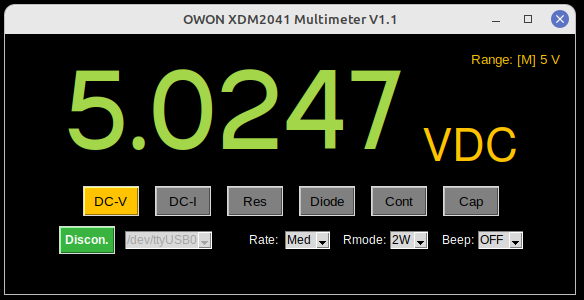

Inspired by these guys: </br>
https://github.com/icrnjavic/OWON-XDM1041_py-util  (Main inspiration) </br>
https://github.com/TheHWcave/OWON-XDM1041 (Very good YouTube series on this)</br>
https://github.com/TechRelief/OWON-Display (Windows only, display only)</br>
https://github.com/martin-bochum/Multimeter (Seems like a very nice one. Could not get it to work on Linux)</br>
https://github.com/markusdd/rusty_meter (Very comprehensive with recording functions)</br>


# Owon_XDM1041 / 2041-Linux-interface
### Supports a simple desktop gui to read and control the DMM. (DC functions only.)</br>



## Usage </br>
First install the requirements
```shell
pip install -r requirements.txt
```

To run the gui
```shell
python3 gui_V11.py
```

